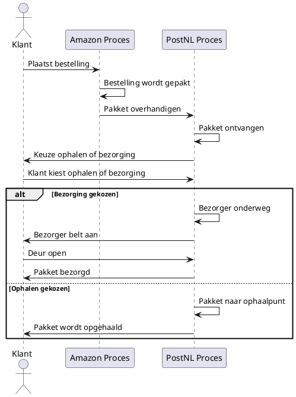

# Communicatie tussen taken

Het onderstaande sequence diagram toont de communicatie tussen het Amazon proces en het PostNL proces.
Het begint met de klant die een bestelling plaatst bij Amazon, waarna het pakket wordt ingepakt en overgedragen aan PostNL.
PostNL vraagt de klant vervolgens om een keuze te maken: ophalen of bezorging.
Afhankelijk van de keuze volgt het pakket het juiste pad, waarbij het ofwel bezorgd wordt door PostNL of naar het ophaalpunt wordt gebracht.

