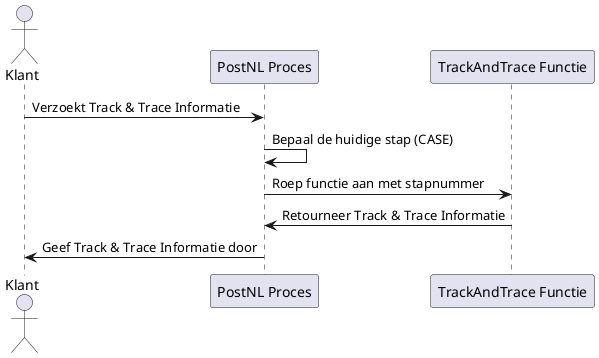

# Functie

Het onderstaande sequence diagram toont de interactie tussen de klant, het PostNL proces en de Track & Trace functie.
Wanneer de klant de Track & Trace informatie opvraagt, bepaalt het PostNL proces de huidige stap van het pakket.
Afhankelijk van de stap wordt de Track & Trace functie aangeroepen, die de bijbehorende statusinformatie retourneert.
Uiteindelijk wordt de Track & Trace informatie aan de klant verstrekt.
s

