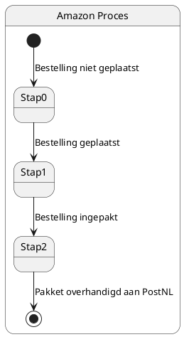

# Taak 1

State diagram die Task 1 weergeeft.

Het onderstaande diagram toont het proces bij Amazon voor de verwerking van een bestelling. 
Het proces begint wanneer de bestelling nog niet is geplaatst. 
Zodra de bestelling is geplaatst en ingepakt, wordt het pakket overhandigd aan PostNL voor verdere verwerking en bezorging.

