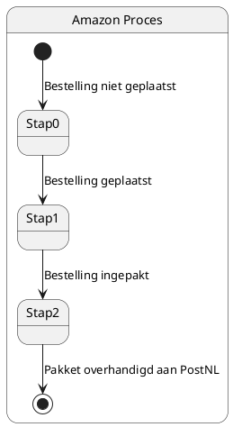

# Task 1

State diagram die Task 1 weergeeft.

```plantuml
@startuml

' Amazon Proces
state "Amazon Proces" as Amazon {
    [*] --> Stap0 : Bestelling niet geplaatst
    Stap0 --> Stap1 : Bestelling geplaatst
    Stap1 --> Stap2 : Bestelling ingepakt
    Stap2 --> [*] : Pakket overhandigd aan PostNL
}

@enduml

```