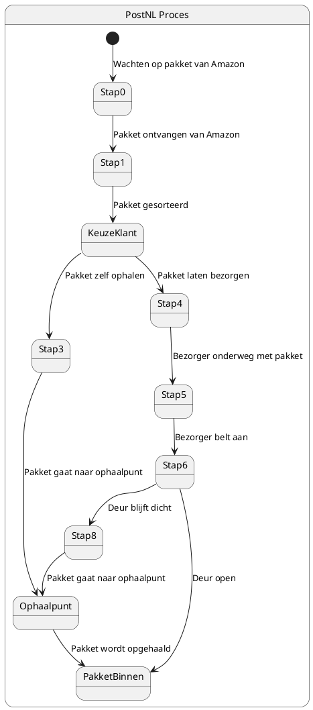

# Taak 2

State diagram die Task 2 weergeeft.

Het onderstaande diagram toont het proces bij PostNL voor de verwerking en bezorging van een pakket. 
Het proces begint wanneer PostNL een pakket ontvangt van Amazon. 
De klant heeft tijdens het bestellen de keuze gemaakt om het pakket zelf op te halen of te laten bezorgen. 
Afhankelijk van de keuze volgt het pakket verschillende routes, waarbij het via een bezorgingstraject of via het ophaalpunt naar de klant gaat.

